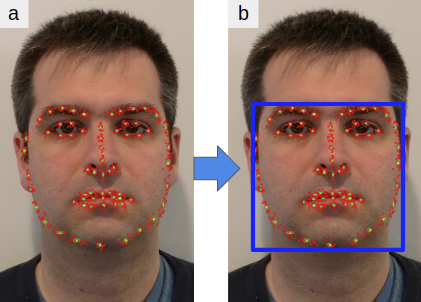
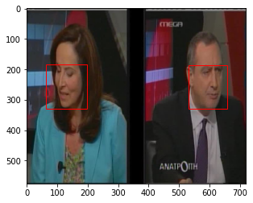
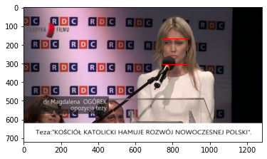

# Pytorch-Lightning Data Module for Face Tracking

This repository contains code that can be used to create a pytorch lightning data module from the following datasets:

- 300 Videos in the Wild ([300VW](https://ibug.doc.ic.ac.uk/resources/300-VW/))
- The CONFER Database ([CONFER](https://ibug.doc.ic.ac.uk/resources/confer/))

Boundary boxes for face tracking can be made by using the min/max of the x and y coordinates of the facial landmarks as can be seen here:

After running `300vw_preprocess.py` and `confer_preprocess.py`, you will have several sets of images and annotations.
Examples of how a boundary box can be visualized is contained in notebooks/visualize_results.ipynb.

A sample is shown below:

